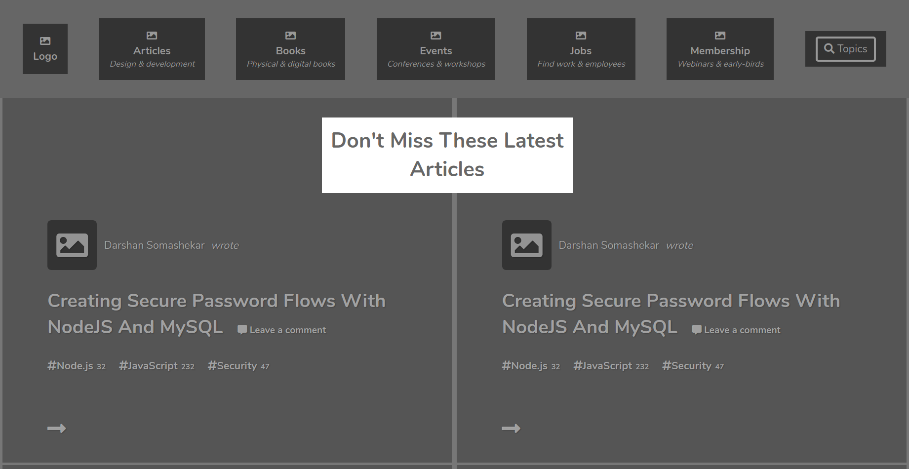

# Positioning and Floating Elements

This project involved creating a heatmap for the Smashing Magazine home page basing on what captures your eye when you first visit the page.

Embedding images
Working with forms (buttons in this case)
Floats and positioning
The box model

Additional description about the project and its features.

## Built With

- html, css
- vs code
- Google fonts

👤 **Nakitto Catherine**

- Github: [@githubhandle](https://github.com/Cathella)
- Twitter: [@twitterhandle](https://twitter.com/cathella9)
- Linkedin: [linkedin](https://www.linkedin.com/in/catherine-nakitto-51ba2a40/)

👤 **Adewale kamilu A**

- Github: [@githubhandle](https://github.com/adewaleK)
- Twitter: [@twitterhandle](https://twitter.com/twitterhandle)
- Linkedin: [linkedin](https://linkedin.com/linkedinhandle)

## 🤝 Contributing

Contributions, issues and feature requests are welcome!

Feel free to check the [issues page](issues/).
